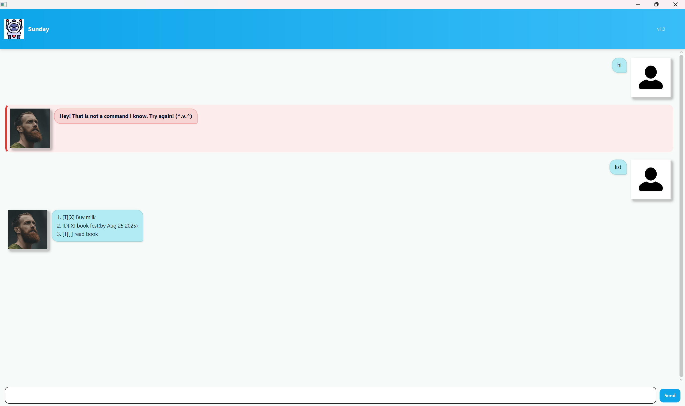

# Sunday User Guide

Sunday chatbot

This is your personal task manger! 

Sunday is a lightweight task manager chatbot with a JavaFX/GUI. 
It supports Todos/Deadline/Event, quick searches, update and an easy-to-use CLI.

## Quick start

Prerequisites

Java 17

(Dev) Gradle wrapper included

Run (dev):

./gradlew run

Build a fat JAR (cross-platform):

./gradlew clean shadowJar 

then run

java -jar build/libs/*-all.jar

Sunday stores data at: data/sunday.txt (created on first save).

# Features
Tips: All commands are 1-index based

Supported date/time input

Dates: yyyy-MM-dd (e.g., 2025-08-25) or d/M/yyyy (e.g., 25/8/2025)

Date-times:
yyyy-MM-dd HHmm, d/M/yyyy HHmm, yyyy-MM-dd HH:mm, d/M/yyyy HH:mm

## Add a todo

Add a task with a description

### Command

todo (description)

### Example

todo read book

### Expected Output

Got it. I've added this task:

[T][ ] Read book

Now you have 1 tasks in the list.

## Add a deadline

Add a task with a description, a deadline

### Command

deadline (description) /by (deadline)

### Example

deadline submit hw /by 2025-08-25

### Expected Output

Got it. I've added this task:

[D][ ] submit hw (by Aug 25 2025)

Now you have 1 tasks in the list.

## Add an event

Add a task with a description, a from, a by

### Command

deadline (description) /from (startDate) /to (endDate)

### Example

event eat dinner /from 2025-08-25 1800 /to 2025-08-25 1900

### Expected Output

Got it. I've added this task:

[E][ ] eat dinner (from: Aug 25 2025 6.00pm to: Aug 25 2025 7.00pm)

Now you have 1 tasks in the list.

## list

list all the task stored

### Command

list

## mark

mark a task as complete

### Command

mark (number)

### Example

mark 2

### Expected Output

GGot it. I have marked this task as done.

[T][X] read book

## unmark

mark a task as incomplete

### Command

unmark (number)

### Example

unmark 2

### Expected Output

Got it. I have marked this task as undone.

[T][] Read book

## find

Search for a task with a given word

### Command

find (string)

### Example

find book

### Expected Output

Here are the tasks that we found:

1. [T][] read book

## Update a task

Update a task with changes

### Command

update <index> /changes [/desc <text>] [/by <date>] [/from <datetime>] [/to <datetime>]

### Example

update 2 /changes /desc Final report /by 2025-10-03

update 3 /changes /desc Career fair /from 2025-10-05 10:00 /to 2025-10-05 12:00

### Expected Output

Updated task:

[D][X] Final report (by Oct 03 2025)

Updated task:

[E][ ] Career fair (from: Oct 05 2025 10:00AM to: Oct 05 2025 12:00PM)

## Exiting the chatbot

Terminal the program

### Command

bye

